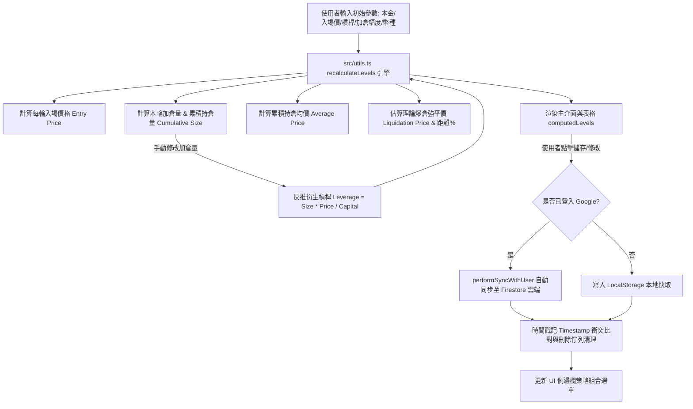

# 🚀 ROLLING POSITION CALCULATOR 2.0 專案技術總結與架構文件

本文件詳細記錄了 **ROLLING POSITION CALCULATOR 2.0（永續合約滾倉盈虧計算機 2.0）** 的整體系統架構、所使用的核心技術棧、數學計算引擎、雲端同步與衝突解決方案、資料處理與前端 PWA 設計細節。

---

## 📌 1. 專案簡介 (Project Overview)

- **GitHub 儲存庫**：[stkao891112/rolling-position-calculator2.0](https://github.com/stkao891112/rolling-position-calculator2.0.git)
- **核心目標**：
  提供一套專為加密貨幣永續合約（Perpetual Futures）趨勢滾倉（Pyramiding / Compound Position Sizing）設計的高精度、視覺化與動態風控計算系統。精確計算每輪加倉入場價、累積持倉均價、估算強平爆倉價（Liquidation Price）、安全距離（%）、名義持倉價值、手續費、淨利潤（PnL）與 ROI，並支援由自訂加倉量反推槓桿倍數。
- **支援交易對與交易所**：
  - **預設幣種**：BTC, ETH, SOL, DOGE, XRP, BNB, AVAX, SUI 等全幣種支援（含自訂代碼與精度）。
  - **支援合約**：U本位 (USDT-Margined) / 幣本位 (Coin-Margined)。
  - **支援交易所選單與 API/條件單模擬**：Binance (幣安), OKX (歐易), Bybit, Bitget, MEXC (抹茶), Hyperliquid 及自訂交易所。

---

## 🛠️ 2. 技術棧與架構 (Technology Stack)

| 分類 (Layer) | 技術 / 工具 (Stack) | 用途與說明 (Description) |
|---|---|---|
| **前端核心 (Frontend Core)** | React 19, TypeScript (~5.8), Vite 6 | 高效能組件化開發、模組化狀態管理與即時計算響應 |
| **視覺與 UI (Styling & Design)** | Tailwind CSS 4, Lucide React (Icons), Custom Glassmorphism CSS | 現代暗黑玻璃擬態 (Dark Glassmorphism) 介面、響應式 Bento Grid 版面佈局 |
| **動態動畫與交互 (Animations)** | Motion / Framer Motion 12, HTML5 Drag & Drop, Canvas Particles | 層級展開/收合動畫、側邊欄拖曳排序（Draggable Strategies）、粒子動態背景 |
| **雲端同步與驗證 (Cloud & Auth)** | Firebase 12 (Firebase Auth, Firestore DB) | Google OAuth 登入 (Popup & Redirect 彈性切換)、Firestore 策略雲端跨裝置同步 |
| **離線快取與 PWA (Offline & Cache)** | Service Worker (PWA), LocalStorage, HTML5 Web Storage | 策略暫存快取、API Key 本地安全隔離存儲、離線全功能可用 |
| **部署與託管 (Deployment)** | Vercel, Firebase Rules | 自動化 CI/CD 部署、SPA 路由重導向 (`vercel.json`) 與 Firestore 安全規則控管 |

---

## 🛡️ 3. 核心技術難點與解決方案 (Core Technical Challenges & Solutions)

### 3.1 難點 1：永續合約雙向滾倉引擎與強平價公式 (Pyramiding Math & Liquidation Formula)
- **問題現象**：
  永續合約包含槓桿 (Leverage)、維持保證金比率 (MM%)、做多/做空方向差異。強平價格估算與均價計算若有微小誤差，將直接影響交易風控。
- **解決方案**：
  - 在 `src/utils.ts` 中設計雙階段 (`recalculateLevels`) 滾倉運算引擎：
    - **做多強平價**：$P_{liq} = P_{entry} \times (1 - \frac{1}{L} + MM\%)$
    - **做空強平價**：$P_{liq} = P_{entry} \times (1 + \frac{1}{L} - MM\%)$
    - **累積持倉均價**：新加倉量時 $\text{AvgPrice} = \frac{\sum (Size_i \times Price_i)}{\text{Total Size}}$；減倉時保持均價不變。
  - 支援 **翻倍滾倉 (`DOUBLE`)**（前一輪利潤達 100% 本金時自動加倉）與 **自訂倍數滾倉 (`CUSTOM_MULTIPLIER`)**。
  - 支援 **盈虧複利 (`PROFIT_REINVEST`)** 與 **固定本金倍數 (`FIXED_MULTIPLIER`)**。

---

### 3.2 難點 2：手動輸入加倉量與槓桿倍數雙向反推與整數微調 (Bi-directional Derivation & Integer Stepping)
- **問題現象**：
  - 當使用者手動自訂某輪「加倉數量」時，系統需自動反推衍生槓桿倍數 $L = \frac{\text{Cumulative Size} \times P_{entry}}{\text{Capital}}$，反推槓桿通常帶有小數點（如 `10.42x`）。
  - 若使用預設 `<input type="number">`，按上下鍵微調時會出現 `10.01` 浮點數微幅跳動，嚴重影響操作體驗。
- **解決方案**：
  - 於 `src/App.tsx` 的槓桿輸入框中同時注入 `step="1"`、`min="1"` 及 `onKeyDown` 鍵盤監聽：
    - 當按 **ArrowUp** 鍵：取整數向上進位 `Math.floor(currentVal) + 1`（如 `10.42` $\rightarrow$ `11`）。
    - 當按 **ArrowDown** 鍵：取整數向下退位 `Math.ceil(currentVal) - 1`（如 `10.42` $\rightarrow$ `10`）。
    - 兼具反推浮點數顯示與手動微調整數變動的雙重優勢。

---

### 3.3 難點 3：Firebase Auth 彈出視窗封鎖與離線資料同步衝突 (Cloud Sync & OAuth Fallback)
- **問題現象**：
  - 手機瀏覽器或嚴格防護環境下，Google 登入彈出視窗常被攔截 (`auth/popup-blocked`)。
  - 使用者在離線狀態下修改或刪除策略組合，重新連線後雲端舊資料可能覆蓋本地最新狀態或讓已刪除項目復活。
- **解決方案**：
  1. **OAuth 降級機制**：捕捉 `signInWithPopup` 異常，自動降級調用 `signInWithRedirect` 與 `getRedirectResult` 確保 100% 登入成功。
  2. **基於 Timestamp 的衝突解決算法**：在 `performSyncWithUser()` 中比較本地與雲端的 `timestamp`；同時於 LocalStorage 建立 `deleted_rolling_strategy_ids` 佇列，連線時優先清除雲端已刪除項目，防止舊資料復原。
  3. **Firestore 資料清洗**：透過 `sanitizeForFirestore()` 遞迴移除所有 `undefined` 欄位，避免 Firestore 報錯。

---

### 3.4 難點 4：多幣種精度適配與行動端 layout shift 防範 (Decimal Precision & Mobile UX)
- **問題现象**：
  - 比特幣 (BTC) 與小幣 (如 DOGE, SHIB) 的持倉數量與價格小數位數差異巨大。
  - 行動裝置點擊表格輸入框時，虛擬鍵盤彈出容易造成網頁版面擠壓與滾動偏移。
- **解決方案**：
  - 建立 `PRESET_CRYPTOS` 預設幣種清單，自動切換 `qtyDecimals` 與 `priceDecimals`。
  - 於小螢幕視窗（`window.innerWidth < 768`）數值更新後自動執行 `activeElement.blur()`，防範鍵盤彈出造成的介面擠壓。

---

### 3.5 難點 5：交易所條件單自動化試算與本地 API 金鑰安全存儲 (API Security & Order Preview)
- **問題現象**：
  - 在交易所掛觸發條件單時，市價單與限價單的觸發價需要根據資產特性進行微幅偏置（如做空時觸發價略低於進場價 $64,999$ vs $65,000$），避免瞬間滑點。
  - 交易所 API Key 與 Secret 若儲存於雲端有外洩風險。
- **解決方案**：
  - 實作 `calculateOrderPrices()`：自動根據幣種價格數量級區分價格步長（BTC 步長 1，ETH/SOL 步長 0.01），自動計算做多/做空之觸發價與委託價。
  - API Key 嚴格限定僅存於使用者瀏覽器 `localStorage` (`rolling_exchange_api_keys`)，零上傳雲端，保障資產安全。

---

## 📁 4. 專案檔案結構 (Repository Architecture)

```
rolling-position-calculator2.0/
│
├── index.html                   # HTML5 模版與 PWA 元資料
├── package.json                 # 專案依賴與腳本 (React 19, Vite 6, Tailwind CSS 4, Firebase 12)
├── tsconfig.json                # TypeScript 嚴格型態設定
├── vite.config.ts               # Vite 打包設定與 React 外掛
├── vercel.json                  # Vercel SPA 路由重導向與部署設定
├── firebase.json                # Firebase 託管與規則設定
├── firestore.rules              # Firestore 安全存取規則 (權限驗證)
├── firebase-applet-config.json  # Firebase 客戶端設定參數
│
├── public/                      # 靜態資源與 PWA 圖示
│   ├── manifest.json            # PWA 應用程式設定檔
│   ├── icon-192.svg / icon-192.png
│   └── icon-512.svg / icon-512.png
│
└── src/                         # 核心原始碼
    ├── main.tsx                 # 應用程式進入點
    ├── App.tsx                  # 核心 UI 介面、狀態管理、側邊欄拖曳與彈窗邏輯
    ├── types.ts                 # 策略參數、滾倉層級、savedStrategy 型態定義
    ├── utils.ts                 # 滾倉數學計算引擎 (均價、強平價、複利、槓桿反推)
    ├── data.ts                  # 加密貨幣預設幣種清單與預設精度
    ├── firebase.ts              # Firebase Auth 驗證與 Firestore 策略同步服務
    ├── index.css                # Tailwind CSS 4 自訂樣式與暗黑玻璃擬態效果
    └── components/
        └── ParticlesBackground.tsx # Canvas 動態粒子背景組件
```

---

## 🔄 5. 滾倉計算與雲端同步流程圖 (Workflow Diagram)



---

## 📝 6. 總結 (Conclusion)

本專案成功整合 **React 19、TypeScript、Tailwind CSS 4 現代暗黑玻璃視覺、Firebase 雲端同步與高精度金融運算引擎**，解決了永續合約滾倉計算複雜、強平價推算、反推槓桿整數微調、行動端介面防擠壓以及跨裝置策略同步的多重技術挑戰。

---

* README generated for repository [stkao891112/rolling-position-calculator2.0](https://github.com/stkao891112/rolling-position-calculator2.0.git) *
